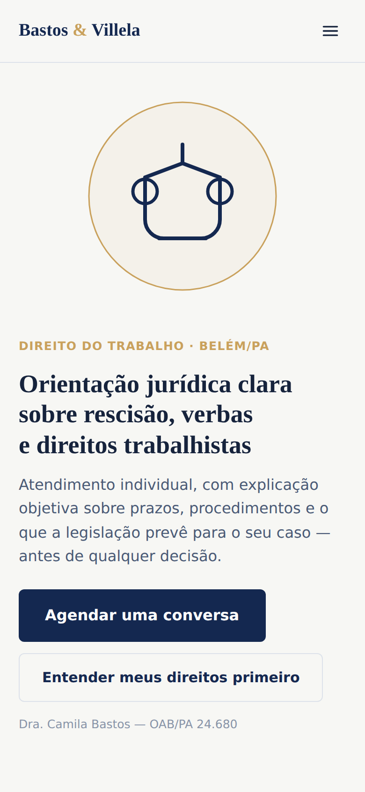
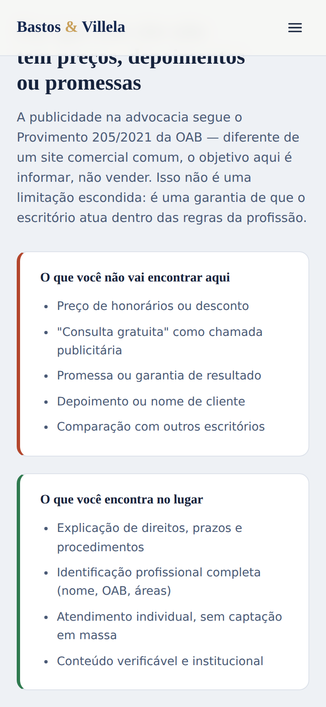

# Bastos & Villela Advocacia — landing page para escritório de direito trabalhista

> **Resumo para quem não é da área de T.I.:** este é um site institucional para um escritório de advocacia (fictício, feito como peça de portfólio). Diferente das outras páginas deste portfólio, o objetivo aqui **não é vender** — é informar. A advocacia no Brasil segue regras específicas da OAB sobre o que pode e não pode aparecer em publicidade, e a página inteira foi desenhada em volta dessas regras: sem preço, sem "consulta gratuita" como isca, sem depoimento de cliente, sem promessa de resultado. No lugar disso, uma calculadora educativa de verbas rescisórias, prazos legais explicados e uma seção que mostra, lado a lado, o que a página evita e por quê.

**Publicado em:** https://landing-advocacia-trabalhista-nine.vercel.app

## Screenshots

| Hero (mobile) | Seção de conformidade (mobile) |
|---|---|
|  |  |

## Por que esse projeto

Os projetos anteriores deste portfólio são sites comerciais comuns (PME, prestador de serviço, produto com tráfego pago) — a lógica de "converter o visitante" é sempre a mesma. A advocacia quebra essa lógica de propósito: é uma área regulada, onde "página de vendas agressiva" é **proibido por norma profissional**, não só malvisto. Escolhi esse nicho para treinar um tipo de projeto diferente dos outros: um em que a restrição não é técnica (performance, SEO, orçamento), e sim regulatória — e onde o diferencial competitivo de um escritório de verdade é justamente mostrar que ele sabe operar dentro dela.

## As regras da OAB aplicadas aqui (resumo dos conceitos)

O Provimento 205/2021 do Conselho Federal da OAB — o código de ética que rege publicidade de advogados no Brasil — foi o ponto de partida do design, não um detalhe adicionado depois. Alguns pontos centrais e onde aparecem no código:

- **Proibido: preço, desconto, "consulta gratuita" como chamada de venda, garantia de resultado, depoimento de cliente, comparação com concorrentes, linguagem comercial/superlativa.** É por isso que a seção `#conformidade` em [`index.html`](index.html) existe: ela lista explicitamente o que a página evita, para deixar claro que a ausência é intencional, não uma limitação de quem fez o site.
- **Permitido e até recomendado: identificação profissional completa (nome, número de inscrição na OAB, áreas de atuação), conteúdo educativo/informativo, e canais de contato para quem já busca o serviço.** É a base da seção `#direitos` — um acordeão (feito com as tags nativas `<details>`/`<summary>` do HTML, sem uma linha de JavaScript) respondendo perguntas reais sobre prazos e direitos trabalhistas, e do rodapé, que traz nome, OAB e endereço.
- **A calculadora de verbas rescisórias (`#calculadora`) foi desenhada como conteúdo educativo, não como isca comercial.** A diferença é sutil mas importa: ela não promete "quanto você vai receber", mostra uma estimativa com disclaimer explícito de que não substitui análise profissional, e termina com um convite para "entender seu caso com um advogado" — nunca "garanta seu dinheiro" ou frase parecida. O comentário no início de `js/script.js` documenta essa escolha de enquadramento.
- **Paleta sóbria e sem gatilhos de urgência.** Nada de contagem regressiva, cores vibrantes ou "vagas limitadas" — o comentário no topo de `css/style.css` explica essa decisão: um escritório de advocacia que parecer estar "vendendo agressivamente" quebra tanto a norma profissional quanto a credibilidade que o cliente espera de um advogado.

## Estrutura

```
landing-advocacia-trabalhista/
├── index.html
├── css/style.css
├── js/script.js
├── docs/            → screenshots deste README
└── .github/workflows/check.yml
```

Página estática, sem build step — só HTML, CSS e JavaScript puro.

## Funcionalidades

- **Calculadora de verbas rescisórias** (`#calculadora`): estimativa educativa de aviso prévio, 13º e férias proporcionais e FGTS (+ multa de 40%, quando aplicável), com resultado e regras diferentes para demissão sem justa causa, pedido de demissão e justa causa.
- **Acordeão de direitos e prazos** (`#direitos`): 4 perguntas reais sobre prescrição trabalhista, verbas de rescisão, assédio moral e acidente de trabalho, usando `<details>`/`<summary>` nativos do HTML (sem JavaScript).
- **Formulário de contato** (`#contato`): monta uma mensagem institucional e abre o WhatsApp já com o texto preenchido — sem linguagem de urgência ou captação.
- **Menu mobile** com fechamento automático ao clicar em um link.

## Decisões de projeto

- **Sem modo escuro e sem paleta "quente":** decisão documentada em `css/style.css` — a sobriedade visual é parte da conformidade com a norma da OAB, não só uma preferência estética.
- **`<details>`/`<summary>` no lugar de um acordeão em JavaScript:** técnica usada pela primeira vez neste portfólio, escolhida porque a seção de direitos é conteúdo estático e não precisa de comportamento customizado — menos código, acessibilidade nativa (funciona com teclado e leitor de tela sem esforço extra).
- **Calculadora com disclaimer em toda resposta, nunca só na primeira tela:** para que o caráter educativo (e não comercial) fique visível mesmo se o visitante rolar direto até o resultado.

## Bugs reais encontrados no processo

Nenhum bug funcional foi encontrado nos testes desta vez — os três cenários da calculadora (demissão sem justa causa, pedido de demissão, justa causa) bateram exatamente com o cálculo manual esperado, e o formulário de contato gerou a mensagem de WhatsApp corretamente no primeiro teste. Isso não significa que o projeto não teve erros durante a escrita — significa que os erros foram pegos e corrigidos antes de eu considerar o código "pronto para testar", em vez de depois.

## Stack

HTML, CSS e JavaScript puro (sem framework, sem build step). Fontes via Google Fonts (Source Serif 4 + Public Sans). Deploy na Vercel a partir do repositório GitHub. CI simples via GitHub Actions, verificando links locais e estrutura básica do HTML a cada push.

---

Projeto de portfólio — escritório e advogada fictícios. Publicidade elaborada em conformidade com o Provimento 205/2021 da OAB (caráter informativo, sem captação de clientela).
